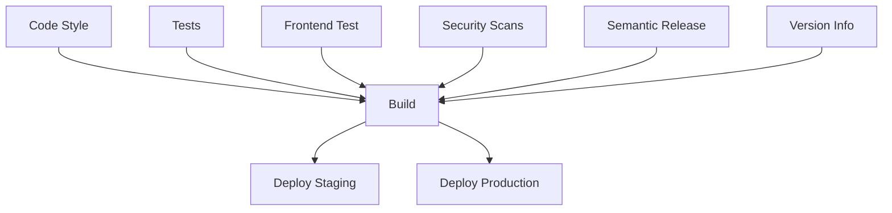

# GitHub Actions CI/CD Setup

This document explains how to set up and use the GitHub Actions CI/CD pipeline for the Citadel project.

## Overview

The GitHub Actions workflow provides:
- **Automated testing** (unit, feature, code style, security)
- **Semantic versioning** with automatic releases
- **Multi-environment deployment** (staging, production)
- **Security scanning** with CodeQL and dependency audits
- **Build artifacts** with version tracking

## Workflow Structure

### 📋 Jobs Overview



### 🧪 Test Jobs
- **code-style**: PHP CS Fixer validation
- **phpstan**: Static analysis with PHPStan
- **test**: Unit and feature tests with coverage
- **frontend-test**: Frontend build validation

### 🔒 Security Jobs
- **composer-audit**: PHP dependency security audit
- **npm-audit**: NPM dependency security audit
- **codeql**: GitHub CodeQL security analysis

### 🏷️ Versioning Jobs
- **semantic-release**: Automatic versioning for main branch
- **version-info**: Development versioning for feature branches

### 🚀 Deployment Jobs
- **build**: Creates versioned deployment artifacts
- **deploy-staging**: Deploys to staging environment
- **deploy-production**: Deploys to production environment

## Required Secrets and Variables

### 🔑 GitHub Secrets

Navigate to **Settings → Secrets and variables → Actions**

#### Repository Secrets:
```bash
# SSH Keys for deployment
STAGING_SSH_PRIVATE_KEY         # SSH private key for staging server
PRODUCTION_SSH_PRIVATE_KEY      # SSH private key for production server

# Optional: Custom GitHub token with extended permissions
GITHUB_TOKEN                    # Automatically provided by GitHub
```

#### Repository Variables:
```bash
# Staging Environment
STAGING_SERVER=staging.example.com
STAGING_USER=deploy
STAGING_PATH=/var/www/citadel-staging
STAGING_URL=https://staging.example.com

# Production Environment  
PRODUCTION_SERVER=production.example.com
PRODUCTION_USER=deploy
PRODUCTION_PATH=/var/www/citadel
PRODUCTION_URL=https://citadel.example.com
```

### 🏢 Environment Setup

Create environments in **Settings → Environments**:

#### Staging Environment
- **Name**: `staging`
- **Protection rules**: None (automatic deployment)
- **Environment variables**: Same as repository variables

#### Production Environment
- **Name**: `production`
- **Protection rules**: 
  - ✅ Required reviewers (recommended)
  - ✅ Wait timer: 5 minutes (optional)
- **Environment variables**: Same as repository variables

## Workflow Triggers

### 🔄 Automatic Triggers

```yaml
# On push to main/develop branches
push:
  branches: [ main, develop ]

# On pull requests to main/develop
pull_request:
  branches: [ main, develop ]

# On manual releases
release:
  types: [ published ]
```

### 📅 Scheduled Triggers

Add to workflow for automated backups:

```yaml
schedule:
  # Daily backup at 2 AM UTC
  - cron: '0 2 * * *'
```

## Branch Strategy

### 🌿 Main Branch (`main`)
- Triggers semantic release
- Creates stable versions (v1.2.3)
- Deploys to production (manual approval)
- Full test suite runs

### 🚧 Develop Branch (`develop`)  
- Creates beta versions (v1.2.3-beta.1)
- Deploys to staging automatically
- Full test suite runs

### 🔧 Feature Branches
- Creates development versions (v1.2.3-feature-branch.abc1234)
- Runs tests and security scans
- No automatic deployment

### 📝 Pull Requests
- Runs all tests and security scans
- Blocks merge if tests fail
- Provides coverage reports

## Deployment Process

### 🎯 Staging Deployment
1. Push to `develop` branch
2. Tests run automatically
3. Build creates versioned artifact
4. **Automatic deployment** to staging
5. Health checks verify deployment

### 🏭 Production Deployment
1. Push to `main` branch
2. Semantic release creates new version
3. Tests and security scans run
4. Build creates versioned artifact
5. **Manual approval** required
6. Deployment with maintenance mode
7. Health checks verify deployment

### 🔄 Rollback Process
1. Download previous version artifact
2. Extract and deploy previous version
3. Run database migrations (if needed)
4. Restore from backup (if needed)

## Semantic Versioning

### 📏 Version Bumps

Same as GitLab - follows Angular conventional commits:

```bash
# Patch: 1.0.0 → 1.0.1
fix: resolve authentication issue

# Minor: 1.0.0 → 1.1.0  
feat: add user profile API

# Major: 1.0.0 → 2.0.0
feat!: redesign authentication

BREAKING CHANGE: JWT tokens now expire after 1 hour.
```

### 🏷️ Release Creation

Semantic release automatically:
1. Analyzes commit messages
2. Determines version bump
3. Generates changelog
4. Creates GitHub release
5. Tags the commit
6. Uploads build artifacts

## Monitoring and Debugging

### 📊 Workflow Status

Monitor workflows in **Actions** tab:
- ✅ Green: All jobs passed
- ❌ Red: One or more jobs failed
- 🟡 Yellow: Jobs running or pending
- ⚪ Gray: Jobs skipped

### 🔍 Debugging Failed Jobs

1. **Click on failed workflow**
2. **Click on failed job**
3. **Expand failed step**
4. **Review logs and error messages**

Common issues:
- **Test failures**: Check test output and fix code
- **Deployment failures**: Verify server connectivity and permissions
- **Build failures**: Check dependencies and environment setup

### 📈 Artifacts and Reports

Access build artifacts and reports:
- **Build artifacts**: Downloadable deployment archives
- **Test coverage**: Coverage reports and metrics
- **Security reports**: Dependency audit results

## Advanced Configuration

### 🎛️ Customizing the Workflow

Edit `.github/workflows/ci-cd.yml`:

```yaml
# Add new job
custom-job:
  name: Custom Job
  runs-on: ubuntu-latest
  steps:
    - name: Checkout code
      uses: actions/checkout@v4
    - name: Run custom command
      run: echo "Custom logic here"
```

### 🔗 Job Dependencies

Control job execution order:

```yaml
deploy-production:
  needs: [test, build, security-scan]  # Wait for these jobs
  if: github.ref == 'refs/heads/main'  # Only on main branch
```

### 🌍 Matrix Builds

Test multiple PHP/Node versions:

```yaml
strategy:
  matrix:
    php-version: [8.1, 8.2, 8.3]
    node-version: [16, 18, 20]
```

### 📝 Custom Scripts

Add deployment scripts:

```yaml
- name: Run custom deployment script
  run: |
    chmod +x ./scripts/deploy.sh
    ./scripts/deploy.sh production
```

## Security Best Practices

### 🔒 Secrets Management
- ✅ Use GitHub Secrets for sensitive data
- ✅ Rotate SSH keys regularly
- ✅ Use environment-specific secrets
- ❌ Never commit secrets to repository

### 🛡️ Permission Management
- ✅ Use least-privilege principle
- ✅ Separate staging and production access
- ✅ Regular access audits
- ✅ Use SSH keys instead of passwords

### 🔍 Security Scanning
- ✅ Enable all security jobs
- ✅ Review security alerts regularly
- ✅ Update dependencies promptly
- ✅ Use CodeQL for code analysis

## Comparison with GitLab CI/CD

| Feature | GitHub Actions | GitLab CI/CD |
|---------|---------------|--------------|
| **Configuration** | `.github/workflows/` | `.gitlab-ci.yml` |
| **Secrets** | Repository/Environment Secrets | CI/CD Variables |
| **Environments** | GitHub Environments | GitLab Environments |
| **Artifacts** | Upload/Download Actions | GitLab Artifacts |
| **Caching** | Actions Cache | GitLab CI Cache |
| **Matrix Builds** | ✅ Native Support | ✅ Parallel Jobs |
| **Semantic Release** | ✅ Full Support | ✅ Full Support |

## Troubleshooting Guide

### 🚨 Common Issues

#### Semantic Release Not Working
```bash
# Check commit messages format
git log --oneline

# Verify GitHub token permissions
# Token needs: repo, write:packages, read:user
```

#### Deployment Timeouts
```bash
# Check server connectivity
ssh user@server "echo 'Connection test'"

# Verify deployment path exists
ssh user@server "ls -la /var/www/"
```

#### Build Failures
```bash
# Check dependency versions
composer show --outdated
npm outdated

# Clear caches locally
composer clear-cache
npm cache clean --force
```

### 📞 Getting Help

1. **Check workflow logs** in Actions tab
2. **Review GitHub Actions documentation**
3. **Check semantic-release logs** for versioning issues
4. **Verify server logs** for deployment issues
5. **Test deployment scripts locally** before pushing

## Migration from GitLab CI/CD

### 🔄 Migration Steps

1. **Copy secrets** from GitLab to GitHub
2. **Update server SSH keys** if needed
3. **Test workflow** on feature branch first
4. **Verify deployments** work correctly
5. **Disable GitLab pipelines** when ready

### 📋 Configuration Mapping

| GitLab CI/CD | GitHub Actions |
|--------------|----------------|
| `variables:` | `env:` |
| `before_script:` | `steps:` |
| `script:` | `run:` |
| `artifacts:` | `upload-artifact:` |
| `needs:` | `needs:` |
| `only/except:` | `if:` |

The GitHub Actions workflow provides the same functionality as GitLab CI/CD with GitHub-native integrations and enhanced security features.
